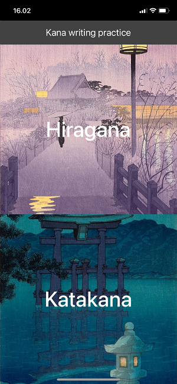
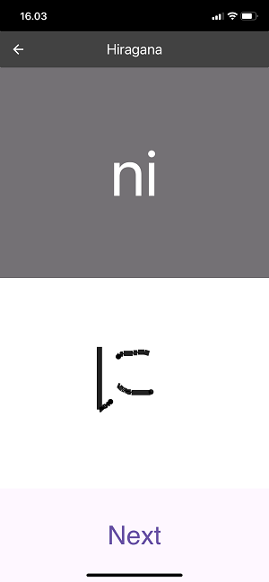

# Kana writing pratice
Simple app written in Flutter for practicing writing Japanese.

 

## Try it out 🚀
The project is hosted on Vercel: [kana-flutter.vercel.app](https://kana-flutter.vercel.app)
